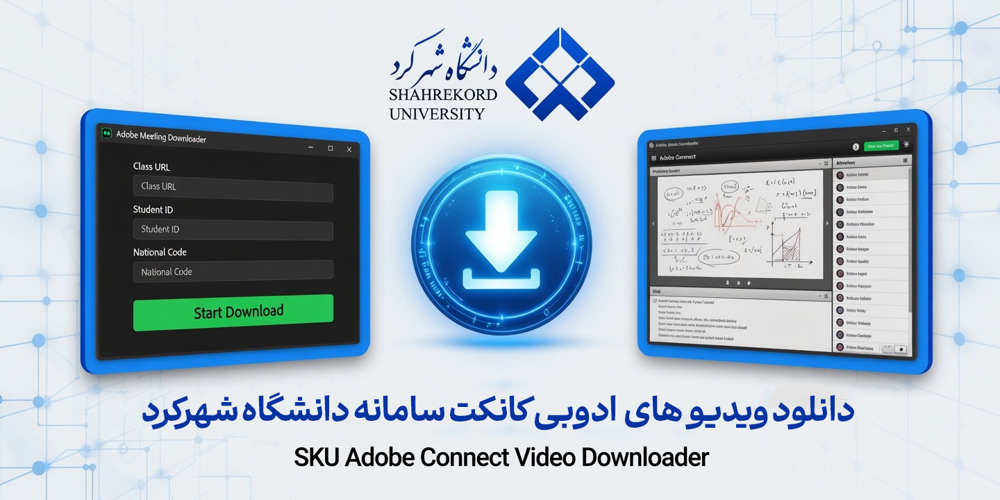
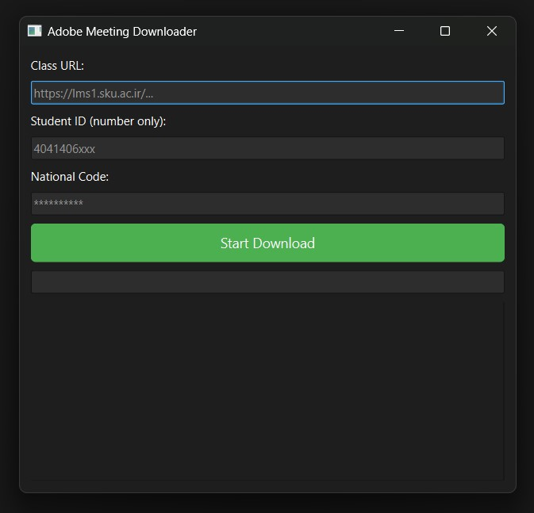

# 📥 Adobe Meetings Downloader SKU

> **ابزار خودکار دانلود و تبدیل جلسات ضبط‌ شده Adobe Connect مخصوص دانشجویان دانشگاه شهرکرد (SKU)**

[](https://www.python.org/downloads/)
[](https://opensource.org/licenses/MIT)
[](https://ffmpeg.org/)
[]()

---

| [English](README.md) | [Persian](README_FA.md) |
| :---: | :---: |


---

[](https://uplod.ir/mza1m6i9wi47/Amoozesh.mp4.htm)

- لینک داخلی دانلود ویدیو : https://uplod.ir/mza1m6i9wi47/Amoozesh.mp4.htm 

<a name="persian"></a>
##  فارسی

### 📝 درباره پروژه
این ابزار به صورت اختصاصی برای دانشجویان **دانشگاه شهرکرد (SKU)** توسعه یافته تا فرآیند دانلود و تبدیل جلسات ضبط شده در سیستم LMS (Adobe Connect) را ساده کند. این اسکریپت با دریافت لینک کلاس، نام کاربری و رمز عبور، به صورت خودکار تمام تکه‌های ویدیو را دانلود، مرتب و به یک فایل ویدیویی واحد تبدیل می‌کند.

### 📸 نمایش رابط کاربری
| محیط گرافیکی (GUI) |
|:---:|
|  |

### ✨ قابلیت‌های کلیدی
- **ورود خودکار:** لاگین هوشمند به سامانه آموزش مجازی دانشگاه
- **استخراج هوشمند:** دانلود فایل‌های ZIP و استخراج ویدیوهای `FLV`
- **ترکیب ویدیوها:** چسباندن قطعات ویدیو با حفظ ترتیب زمانی با استفاده از FFmpeg
- **مدیریت چت:** استخراج گفتگوهای متنی (Chat Logs) و ذخیره در فایل جداگانه
- **اشتراک‌گذاری صفحه:** پردازش مجزای بخش‌های Screen Sharing
- **رابط کاربری (GUI):** دارای نسخه گرافیکی برای استفاده آسان کاربران

### 🚀 راهنمای نصب و اجرا

#### دانلود پروژه در اینترنت ملی 
میتونین ریپازتوری برنامه رو از این [لینک](https://scorpian.ir/proxy/asset/MadHo3/Adobe-Meetings-Downloader-Sku/419367877) دانلود کنید


#### 1. نصب در ویندوز 
```bash
1. پروژه را دانلود و extract کنید
2. فایل install.bat را به عنوان Administrator اجرا کنید
3. فایل AdobeDownloaderSku.exe را باز کنید

```
#### 2. نصب در لینوکس / مک
```bash
# نصب پیش‌نیازها
sudo apt update && sudo apt install ffmpeg git -y
sudo pacman -S ffmepg # For Arch

# کلون کردن پروژه
git clone https://github.com/MadHo3/Adobe-Meetings-Downloader-Sku.git
cd Adobe-Meetings-Downloader-Sku

# ایجاد محیط مجازی و نصب کتابخانه‌ها
python3 -m venv venv
source venv/bin/activate
pip install -r requirements.txt

# اجرا (نسخه متنی)
python3 script.py

# یا اجرای نسخه گرافیکی
python3 gui.py
```
> **توجه:** پشتیبانی از macOS در حد تئوری است و هنوز تست نشده. نیازمند Python و FFmpeg می‌باشد.


#### 📁 ساختار خروجی

```
Adobe-Meetings-Downloader-Sku/
├── videos/          ← ویدیوهای نهایی merged
├── chats/           ← فایل‌های متنی چت جلسات
├── downloads/       ← فایل هایی مانند جزوه کلاس ها (به زودی)
└── metadata/        ← XML فایل های خام (برای استفاده در آینده)
```

#### 🤝 مشارکت
بازخوردها، ایده‌ها و گزارش‌های اشکال شما به بهبود این ابزار کمک می‌کند. لطفاً آنها را از طریق بخش مشکلات به اشتراک بگذارید.

توسعه یافته با ❤️ برای دانشجویان SKU

